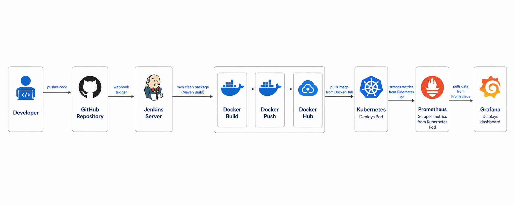

# End-to-End CI/CD Pipeline with Monitoring

A production-style DevOps project that automates the build, test, containerization, deployment, and monitoring of a Spring Boot application using industry-standard tools. The pipeline triggers automatically on every GitHub push via webhook integration.

---

## Project Overview

This project demonstrates a fully automated CI/CD pipeline. When a developer pushes code to GitHub, a webhook notifies Jenkins which immediately triggers the pipeline — running Maven tests, building a Docker image, pushing it to DockerHub, deploying to a Kubernetes cluster, and monitoring the entire infrastructure using Prometheus and Grafana.

---

## Architecture



```
Developer → GitHub Push
               ↓
        GitHub Webhook (port 8080)
               ↓
           Jenkins (CI/CD)
               ↓
        Maven Test + Build + Verify
               ↓
        Docker Build + Push (DockerHub)
               ↓
        Kubernetes Deploy (Master + Worker Nodes)
               ↓
        Prometheus (Metrics Collection)
               ↓
        Grafana (Visualization + Monitoring)
```

---

## Tools and Technologies

| Category | Tool |
|---|---|
| Application | Spring Boot (Java 8) |
| Build Tool | Maven |
| CI/CD | Jenkins |
| Containerization | Docker |
| Container Registry | DockerHub |
| Orchestration | Kubernetes |
| Infrastructure | AWS EC2 (Ubuntu) |
| Monitoring | Prometheus |
| Visualization | Grafana |
| Version Control | GitHub |

---

## Infrastructure Setup

| Node | Instance | Role |
|---|---|---|
| Master Node | AWS EC2 (Ubuntu) | Jenkins, Docker, Kubernetes Master, Prometheus, Grafana |
| Worker Node(s) | AWS EC2 (Ubuntu) | Kubernetes Worker, Node Exporter |

---

## How Automatic Triggering Works

This pipeline does not require manual intervention. Every push to the main branch automatically triggers the pipeline via GitHub webhook.

**Flow:**
```
git push origin main
       ↓
GitHub sends POST request to http://<jenkins-ip>:8080/github-webhook/
       ↓
Jenkins receives webhook and starts pipeline immediately
       ↓
Full pipeline runs automatically end to end
```

**Setup required:**
- GitHub repo → Settings → Webhooks → Payload URL: `http://<master-ip>:8080/github-webhook/`
- Jenkins job → Build Triggers → GitHub hook trigger for GITScm polling → enabled
- Jenkins GitHub Integration plugin installed
- EC2 port 8080 open in security group

---

## Pipeline Stages

| Stage | Command | Purpose |
|---|---|---|
| Code Cloning | git clone | Pulls latest code from GitHub main branch |
| Maven Unit Test | mvn test | Runs all unit tests |
| Maven Build | mvn clean install | Packages application as JAR |
| Maven Integration Test | mvn verify | Runs integration tests |
| Docker Build | docker build | Builds Docker image from Dockerfile |
| Push to DockerHub | docker push | Pushes tagged image to DockerHub registry |
| Deploy to Kubernetes | kubectl apply | Applies deployment and service manifests |
| Verify Deployment | kubectl rollout status | Confirms all pods are running healthy |

---

## Monitoring Stack

Prometheus scrapes metrics from Jenkins and all nodes. Grafana visualizes them in real time.

**Scrape targets configured in prometheus.yml:**

```
localhost:9090        → Prometheus self monitoring
localhost:8080        → Jenkins pipeline metrics
localhost:9100        → Master node system metrics
<worker-node-ip>:9100 → Worker node system metrics
```

**Grafana Dashboards:**

| Dashboard | ID | Monitors |
|---|---|---|
| Jenkins Performance and Health | 9964 | Build success/fail rate, duration, queue |
| Node Exporter Full | 1860 | CPU, RAM, Disk, Network on all nodes |

**How Jenkins metrics flow to Grafana:**
- Jenkins Prometheus Metrics plugin exposes `/prometheus` endpoint
- Prometheus scrapes this endpoint every 15 seconds
- Grafana reads from Prometheus and displays pipeline health in real time

---

## Project Structure

```
DevOps-CICD-Project/
├── src/                        # Spring Boot application source code
├── Dockerfile                  # Docker image definition
├── deployment.yaml             # Kubernetes Deployment manifest
├── service.yaml                # Kubernetes Service manifest (NodePort)
├── Jenkinsfile                 # Complete CI/CD pipeline definition
├── pom.xml                     # Maven build configuration
└── README.md                   # Project documentation
```

---

## Jenkins Plugins Required

| Plugin | Purpose |
|---|---|
| Git | Source code cloning |
| Maven Integration | mvn commands in pipeline |
| Docker Pipeline | Docker build, tag, push |
| Kubernetes CLI | kubectl commands |
| Kubernetes Credentials | Kubeconfig binding |
| Credentials Binding | Secure credential injection |
| GitHub Integration | Webhook trigger support |
| Prometheus Metrics | Exposes /prometheus endpoint |
| Blue Ocean | Visual pipeline dashboard |
| Pipeline | Core Jenkinsfile execution |

---

## Jenkins Credentials Setup

| Credential ID | Type | Purpose |
|---|---|---|
| dockerHub | Username + Password | DockerHub login for image push |
| k8s | Kubeconfig file | Kubernetes cluster access |

---

## Port Reference

| Service | Port | Node |
|---|---|---|
| Jenkins | 8080 | Master |
| Jenkins metrics endpoint | 8080/prometheus | Master |
| Prometheus | 9090 | Master |
| Grafana | 3000 | Master |
| Node Exporter | 9100 | Master + All Workers |
| Application | NodePort (30000-32767) | Worker |

---

## How to Run

**1. Clone the repository**
```bash
git clone https://github.com/Mohanm1995/DevOps-CICD-Project.git
cd DevOps-CICD-Project
```

**2. Create Jenkins pipeline job**
- New Item → Pipeline → Pipeline script from SCM
- SCM: Git → your repo URL
- Branch: main
- Script Path: Jenkinsfile

**3. Add credentials in Jenkins**
- dockerHub → DockerHub username and password
- k8s → kubeconfig file of your cluster

**4. Configure GitHub webhook**
- GitHub repo → Settings → Webhooks → Add webhook
- Payload URL: `http://<master-node-ip>:8080/github-webhook/`
- Content type: application/json
- Trigger: Just the push event

**5. Push code to trigger pipeline**
```bash
git add .
git commit -m "your message"
git push origin main
```
Jenkins pipeline starts automatically.

**6. Access the application**
```bash
kubectl get svc myservice
```
Open: `http://<worker-node-ip>:<NodePort>`

**7. Access monitoring**
```
Prometheus : http://<master-ip>:9090
Grafana    : http://<master-ip>:3000 (admin/admin)
```

---

## Key Learnings

- Automated end-to-end pipeline from code commit to production deployment without manual intervention
- GitHub webhook integration for real-time pipeline triggering on every push
- Docker containerization of a Java Spring Boot application
- Kubernetes deployment and service management across master and worker nodes
- Real-time infrastructure and pipeline monitoring with Prometheus and Grafana
- Secure credential management in Jenkins using credentials binding plugin

---

## Author

**Mohan M** 

AWS & DevOps Engineer

---

## Notes

- Port 8080 must be open in EC2 security group for GitHub webhook to reach Jenkins
- Prometheus metrics plugin must be installed in Jenkins before monitoring works
- Node Exporter must be running on all nodes before Prometheus scraping starts
- Update image name in deployment.yaml if you fork this repo

---
